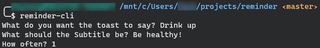

# Reminder CLI App

This is a SUPER simple CLI app, written in C++, to send you reminders at a given intervals.

Currently, this app is WSL only. Hopefully in the future I can extend it to work on Windows, Mac, and Red Hat.




## Prerequisites

- PowerShell Module `BurntToast`
- GCC

## Installation

```bash
git clone https://github.com/zlhysong/reminder-cli.git
cd reminder-cli
g++ reminder.cpp -o reminder-cli
sudo mv reminder-cli /usr/bin/reminder-cli
```

## Usage

Simply run `reminder-cli` and follow the prompts.
It will ask you for two text entries, the first is the first line of the Toast Notification, and the second is the subtitle.
Then enter the interval at which you want reminded, in minutes.

The app will then run and you can send it to the background with `CTRL-Z` then `bg` to make it continue running while you do other things.

## TODO

- Start running in background after initial questions, or, better, start app with parameters and immediately move to background.
- Test on Windows
- Create Gnome version for working on Red Hat (This is a personal goal since I am also learning RHEL for my certification)
